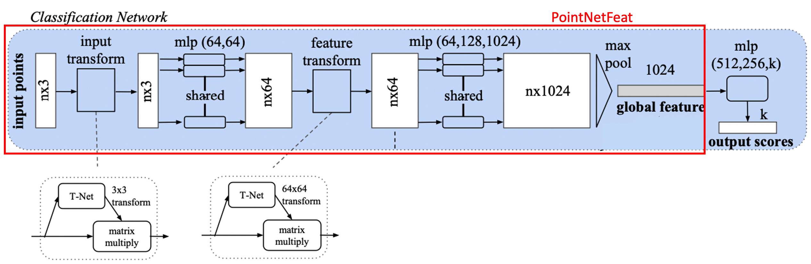
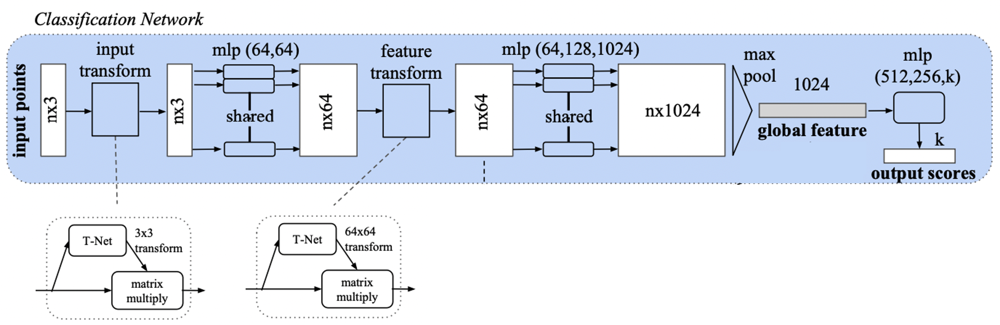
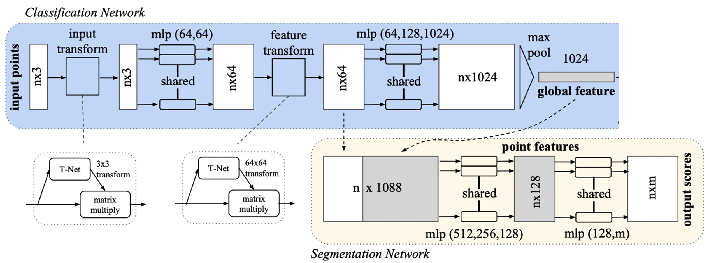
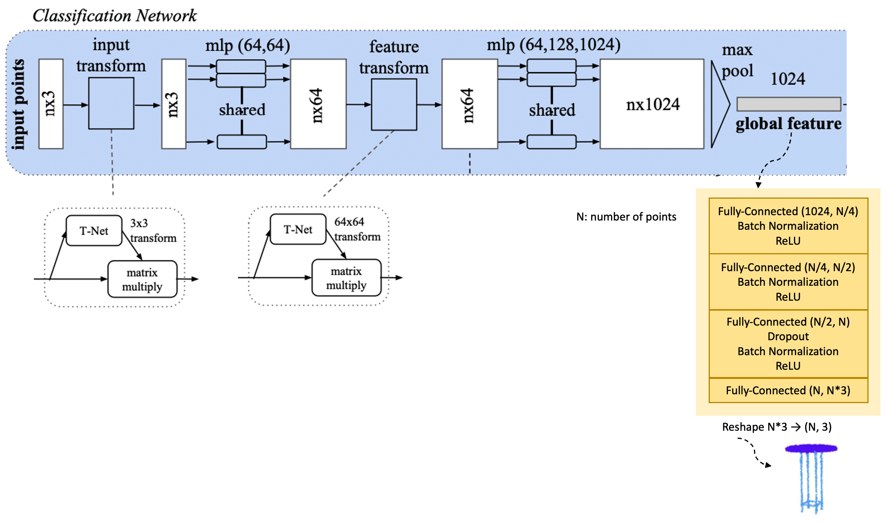

## KAIST Geometric AI Lab - Tutorial 1
Instructor: [Minhyuk Sung](https://mhsung.github.io/) (mhsung@kaist.ac.kr)

Session Host: **Hyunjin Kim** (Lead), **Eunji Hong** (Support)

Last Updated: Jun 13, 2023.

If you have any question, feel free to ask us via Slack DM.

(Thanks to Juil Koo for providing the codebase.)

## PointNet: Point Cloud Processing Network

[PointNet](https://arxiv.org/abs/1612.00593) is a fundamental yet powerful neural network processing point cloud data. In the first tutorial, we will learn how to use PointNet for different tasks including _classification_, _auto-encoding_, and _segmentation_ by implementing them. Since we aim to make you familiar with implementing neural network models and losses using Pytorch, we provide skeleton codes and what you have to do is just fill in the **TODO** parts of the codes. Before implementing codes, please read the [PointNet](https://arxiv.org/abs/1612.00593) paper and the provided codes careful and check how codes flow. Also, we recommend you to read how to implement codes using Pytorch ([Tutorial link](https://pytorch.org/tutorials/beginner/pytorch_with_examples.html)).

## Project Structure
Below shows the overall structure of this repository. Bascially, in this tutorial, what you have to do is implementing models and losses by filling in the **TODO** parts of below 4 files.
 ### TODOs
```
- model.py
- train_cls.py
- train_ae.py
- train_seg.py
```

```
pointnet
│ 
├── model.py              <- PointNet models implementation. <TODO>
│ 
├── dataloaders 
│   ├── modelnet.py         <- Dataloader of ModelNet40 dataset.
│   └── shapenet_partseg.py <- Dataloader of ShapeNet Part Annotation dataset. 
│
├── utils
│   ├── metrics.py          <- Easy-to-use code to compute metrics.
│   ├── misc.py             <- Point cloud normalization ft. and code to save rendered point clouds. 
│   └── model_checkpoint.py <- Automatically save model checkpoints during training.
│
├── train_cls.py          <- Run classification. <TODO>
├── train_ae.py           <- Run auto-encoding. <TODO>
├── train_seg.py          <- Run part segmentation. <TODO>
├── visualization.ipynb   <- Simple point cloud visualization example code.
│
├── data                  <- Project data.
│   ├── modelnet40_ply_hdf5_2048     <- ModelNet40   
│   └── shapenet_part_seg_hdf5_data  <- ShapeNet Part Annotation
│
└── checkpoints           <- Directory storing checkpoints. 
    ├── classification
    │    └── mm-dd_HH-MM-SS/epoch=16-val_acc=88.6.ckpt
    ├── auto_encoding
    └── segmentation
```

## Environment Setup

Install Pytorch using Conda.
```bash
conda create -n week1 python=3.9
conda install pytorch==1.13.0 torchvision==0.14.0 torchaudio==0.13.0 pytorch-cuda=11.6 -c pytorch -c nvidia
```

Install necessary packages.
```bash
pip install tqdm h5py matplotlib ninja chamferdist
```

## Task 0. Global Feature Extraction


PointNet takes 3D point clouds(# points, 3) as inputs and extracts a 1024-sized global feature latent vector, which contains the geometric information of the input point clouds. This global feature vector will be used in the downstream tasks; point cloud classification, segmentation, and auto-encoding. In this part, you implement PointNetFeat model that only results out the global feature vector so that you can utilize this model for implementing the remaining 3 tasks.

### TODOs
```
- model.py
```
- Fill in the **TODO** in model.py > PointNetFeat class

※ When implementing PointNetFeat, you can utilize STDkd we give you in model.py code. 


## Task 1. Point Cloud Classification
**_Success condition: You will get the perfect score if you achieve test accuracy over 85%._**


In point cloud classification tasks, PointNet inputs point clouds (# points, 3) and generates a 1024-sized global feature latent vector, which is then reduced to the number of categories (k) through multi-layer perceptrons, forming logits for each category. 

### TODOs
```
- model.py
- train_cls.py
```
- Fill in the **TODO** in `model.py` > `PointNetCls`
- Fill in the **TODO** in `train_cls.py` > `step` and `train_step`
- Train the model by the following command.

```bash
python train_cls.py [--gpu 0] [--epochs 100] [--batch_size 32] [--lr 1e-3] [--save]
```

If you pass `--save` option, only the topk model checkpoints will be saved in `checkpoints` directory. 

On ModelNet40 test set:

|                                | Overall Acc |
| ------------------------------ | ----------- |
| Paper                          | 89.2 %      |
| Ours (w/o feature trans.)      | 88.6 %      |
| Ours (w/ feature trans.)       | 87.7 %      | 


## Task 2. Point Cloud Part Segmentation
**_Success condition: You will get the perfect score if you achieve test mIoU over 80%._**


For segmentation tasks, PointNet concatenates the second transformed feature with the global latent vector to form a point-wise feature tensor, which is then passed through an MLP to produce logits for m part labels.

### TODOs
```
- model.py
- train_seg.py
```
- Fill in the **TODO** in `model.py` > `PointNetPartSeg`
- Fill in the **TODO** in `train_seg.py` > `step` and `train_step`
- Train the model by the following command.

```bash
python train_seg.py [--gpu 0] [--epochs 100] [--batch_size 32] [--lr 1e-3] [--save]
```

After implementing the network, call the network in `train_seg.py`. You should be able to see progress bars:


ShapeNet part dataset will automatically be downloaded on `data` directory when `train_seg.py` is first executed.

We provide the code to measure instance mIoU in `utils/metrics.py`.

On ShapeNet Part test set:
|        | ins. mIoU |
| ------ | --------- |
| Paper  | 83.7 %    |
| Ours   | 83.6 %    | 


## Task 3. Point Cloud Auto-Encoding
**_success condition: You will get the perfect score if you achieve chamfer distance lower than 0.005 on the test set._**


The PointNet Auto-encoder comprises an encoder that inputs point clouds and produces a 1024-sized global feature latent vector, and an MLP decoder that expands this latent vector incrementally until it reaches N*3. This tensor is reshaped into (N, 3), representing N points in 3D coordinates.

### TODOs
```
- model.py
- train_ae.py
```
- Fill in the **TODO** in `model.py` > `PointNetAutoEncoder`
- Fill in the **TODO** in `train_ae.py` > `step` and `train_step`
- Train the model by the following command.

```
python train_ae.py [--gpu 0] [--epochs 100] [--batch_size 32] [--lr 1e-3] [--save]
```

On ModelNet40 test set:
|        | Chamfer Dist. |
| ------ | ------------- |
| Ours   | 0.0043        |


## FYI
We provide some util codes to help you. Feel free to use them if you need.
- utils/model_checkpoint.py: tracks model's metric and automatically save only topk checkpoints.
- visualization.ipynb: simple visulization code on jupyter lab.

## Reference
- [PointNet: Deep Learning on Point Sets for 3D Classification and Segmentation](https://arxiv.org/abs/1612.00593)
